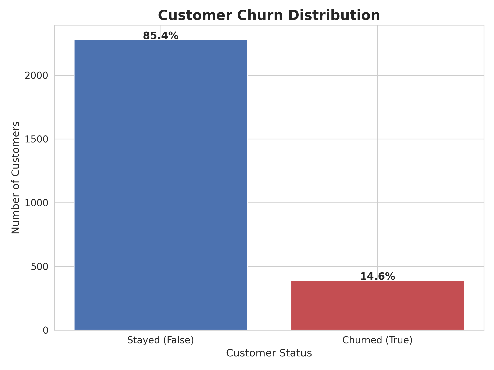
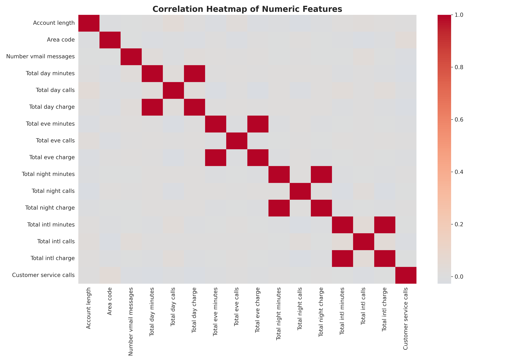
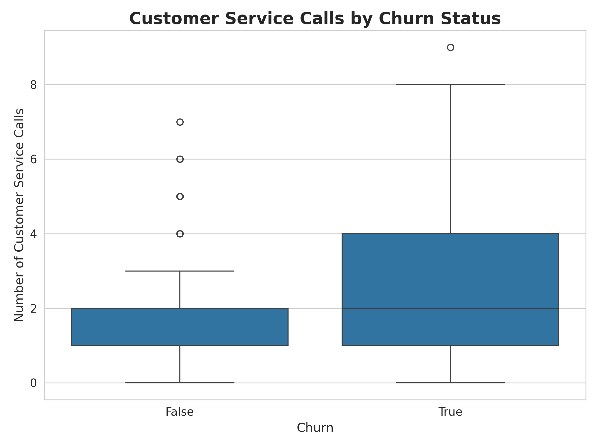
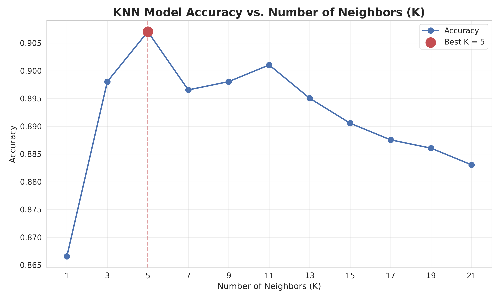
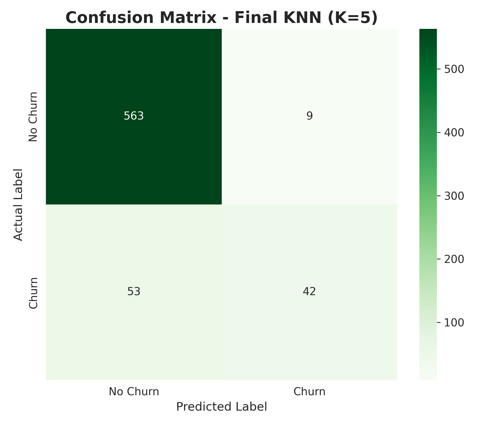

# Level 1 - Task 3: Customer Churn Prediction Using K-Nearest Neighbors (KNN)

**Codveda Technologies Machine Learning Internship**

A K-Nearest Neighbors classifier built with scikit-learn to predict customer churn from historical telecom customer data.

## Project Overview

This project implements an end-to-end classification pipeline: loading and exploring telecom customer data, cleaning and encoding features, scaling them for a distance-based algorithm, tuning the number of neighbors (K), and evaluating the final model through accuracy, precision, recall, F1-score, and a confusion matrix.

**Dataset:** Telecom Customer Churn — pre-split into a training set (`churn-bigml-80.csv`, 2,666 customers) and a testing set (`churn-bigml-20.csv`, 667 customers), 20 original features including call usage, charges, plan types, and customer service calls.

## Data Preparation

| Step | Details |
|---|---|
| Missing values | 0 in both training and testing sets |
| Duplicate rows | 0 in both training and testing sets |
| Class balance (training) | No Churn: 2,278 (85.45%) · Churn: 388 (14.55%) |
| Dropped columns | `State`, `Area code` (high-cardinality identifiers, non-predictive) |
| Encoded columns | `International plan`, `Voice mail plan`, `Churn` (Yes/True → 1, No/False → 0) |
| Final feature count | 17 numeric features |
| Feature scaling | `StandardScaler` (required for KNN's distance-based calculations) |

## Hyperparameter Tuning

11 values of K were tested to find the best-performing model:

| K | Accuracy | K | Accuracy |
|---|---|---|---|
| 1 | 86.66% | 13 | 89.51% |
| 3 | 89.81% | 15 | 89.06% |
| **5** | **90.70%** | 17 | 88.76% |
| 7 | 89.66% | 19 | 88.61% |
| 9 | 89.81% | 21 | 88.31% |
| 11 | 90.10% | | |

**Best K = 5**, with 90.70% accuracy on the test set.

## Results

| Metric | Score |
|---|---|
| Accuracy | **90.70%** |
| Precision (Churn) | 82.35% |
| Recall (Churn) | 44.21% |
| F1-score (Churn) | 57.53% |

**Classification Report (test set):**

| Class | Precision | Recall | F1-score | Support |
|---|---|---|---|---|
| No Churn | 0.91 | 0.98 | 0.95 | 572 |
| Churn | 0.82 | 0.44 | 0.58 | 95 |

**Confusion Matrix** (rows = actual, columns = predicted):

| | Predicted: No Churn | Predicted: Churn |
|---|---|---|
| **Actual: No Churn** | 563 | 9 |
| **Actual: Churn** | 53 | 42 |

Out of 667 test customers, 605 were correctly classified and 62 were misclassified.

## Visualizations

| | |
|---|---|
|  |  |
|  |  |
|  | |

## Key Takeaways

- Of the 95 customers who actually churned in the test set, the model correctly caught only 42 (44.21% recall) — more than half of at-risk customers were missed, largely because churners are the minority class (14.55% of training data).
- When the model does flag a customer as likely to churn, it's correct 82.35% of the time (precision), making its "at risk" flags fairly trustworthy for the retention team to act on.
- **Customer service calls** and **day-time usage** showed a notable relationship with churn during exploratory analysis, making them useful signals for retention outreach.
- Because the dataset is imbalanced, accuracy alone (90.70%) is a misleading measure of success on its own — precision, recall, and F1-score together give a fuller picture of model performance.

## Tools & Libraries

Python · scikit-learn · pandas · NumPy · Matplotlib · Seaborn · joblib

## How to Run

1. Open `Level1_Task3_KNN_CustomerChurn.ipynb` in Google Colab.
2. Make sure `churn-bigml-80.csv` and `churn-bigml-20.csv` are placed in the `Codveda_Internship/Level1_Task3_KNN_CustomerChurn/` folder in Google Drive.
3. Run all cells top to bottom (mounts Google Drive to load data and save outputs).
4. Trained model, scaler, charts, tables, and reports are saved automatically to the `outputs/` folder in Google Drive.

## Future Improvements

- Apply class-imbalance techniques (e.g. SMOTE or class weighting) to improve recall on the minority churn class.
- Compare against other classifiers (Logistic Regression, Random Forest, XGBoost) as a benchmark against this KNN baseline.
- Use cross-validation instead of a single train/test split for a more robust performance estimate.

---
## Author

**Lady Jean Y. Geverola**

BS Data Science
University of the Philippines Mindanao
